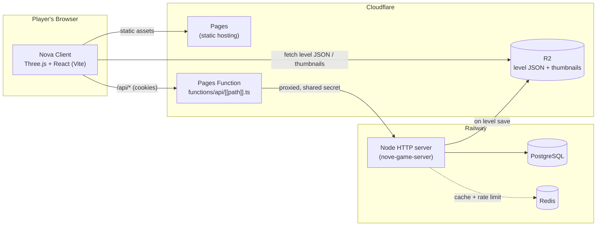
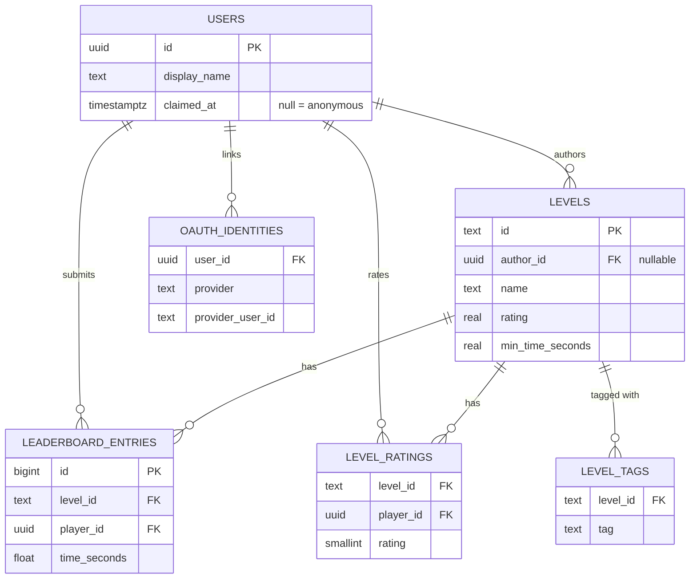
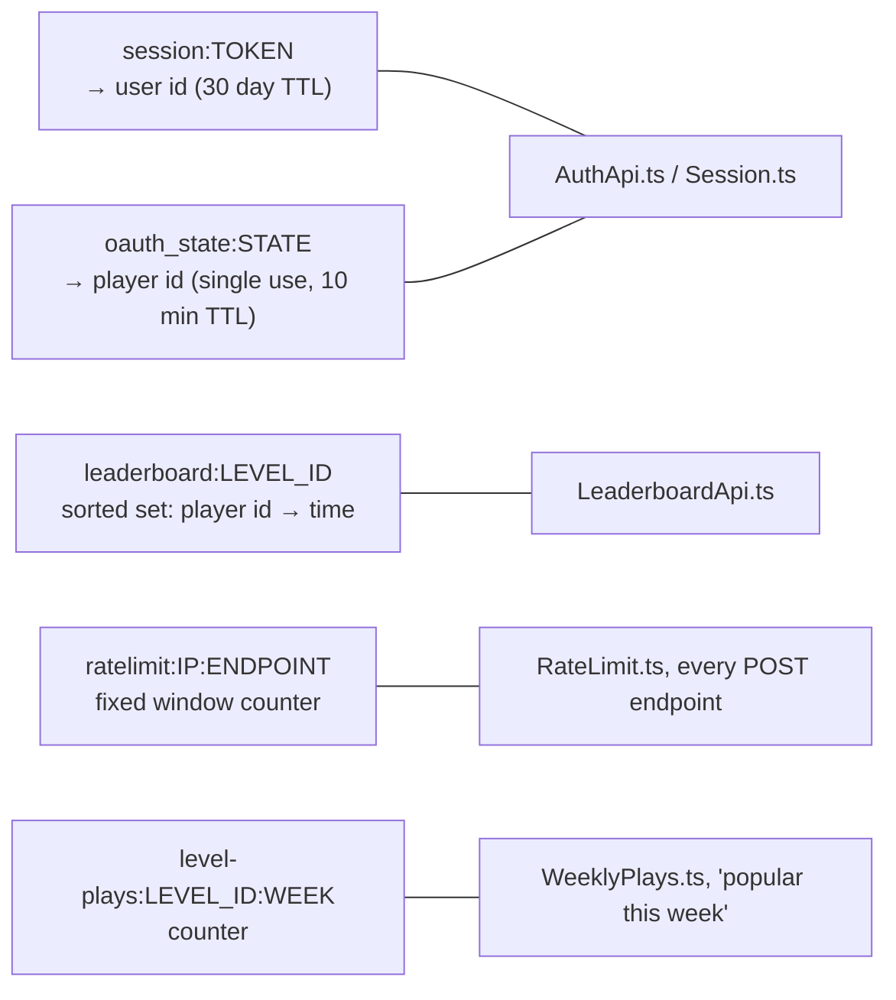
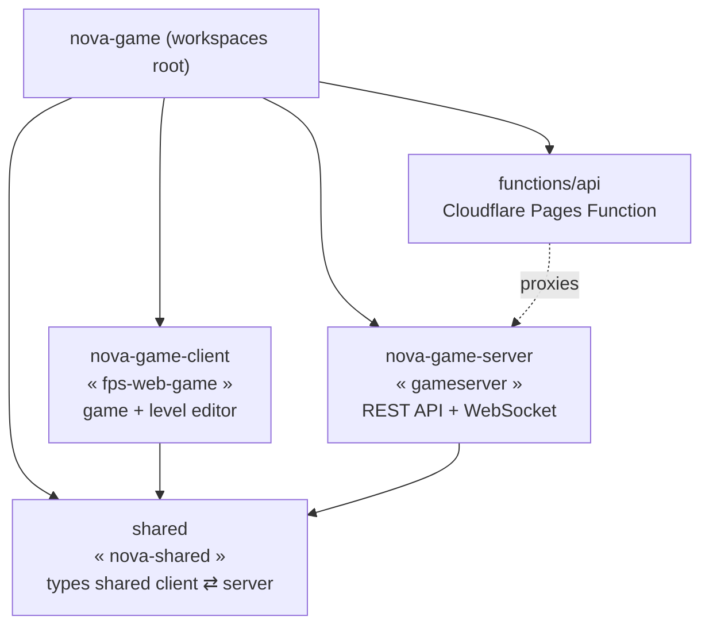
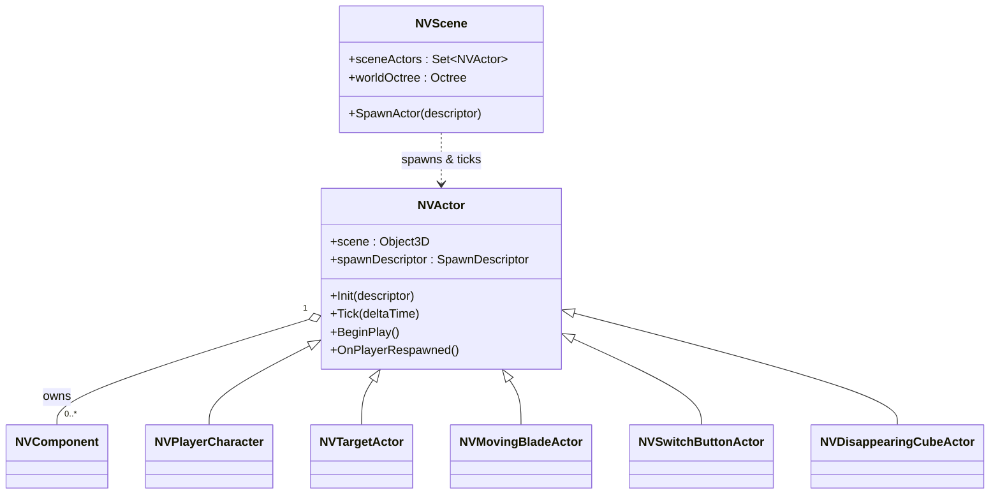
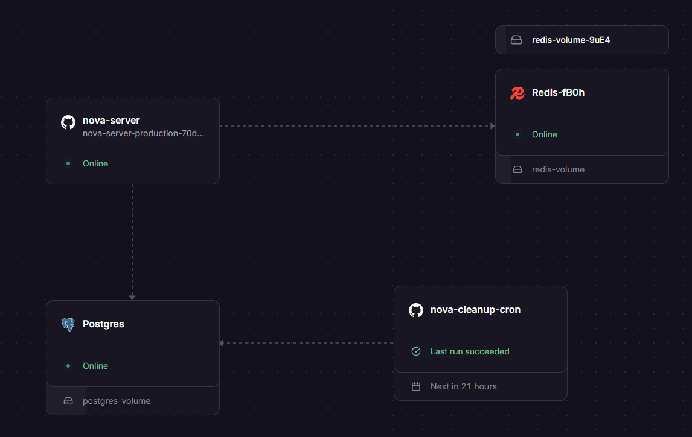

# Nova

Nova is a web based time trial FPS, similar to Seum. Run through a hand built level as fast as
you can, shoot every target, hit the goal, and your time goes on the leaderboard. There's a full
level editor built in too, so players can build their own levels and upload them for everyone
else to play.

  

**Play it:** [nova.mattheritage.dev](https://nova.mattheritage.dev)

## Features

- **Core loop**: countdown, run the level, shoot the targets, avoid taking damage, reach the goal, time gets
  submitted to that level's leaderboard.
- **Hazards**: spikes, a laser firing cannon, moving blades, falling platforms, moving doors, and color switch blocks.
- **Level editor**: a free fly editor pawn, a move/rotate/scale gizmo with multi select and
  alt drag duplication, a categorized actor palette, export/import, play in editor testing, and a
  real upload flow with validation on both ends.
- **Level browser and leaderboards**: browse community levels with thumbnails, ratings, tags and
  play counts. Every level has a real top 5 leaderboard, plus your own rank if you're outside it.
- **Accounts**: Anonymous player identity automatically, no signup needed to play (these accounts get deleted after 7 days unless claimed via GitHub)
  or show up on a leaderboard. You can also sign in with GitHub OAuth to keep your name and history permanently.

## Architecture

### System overview

The client is a static single page app. The backend is a plain Node HTTP server with no
framework. Cloudflare sits in front of both: Pages serves the client, and a Pages Function
proxies `/api/*` to Railway so the browser only ever talks to one origin.

Postgres is the source of truth for everything: users, levels, leaderboard entries. Redis sits in
front of it as a fail open accelerator, a sorted set cache per level's leaderboard and a per IP
rate limiter. It's never the only copy of anything. A separate scheduled Railway service wipes
stale anonymous accounts every day.

### Postgres schema

`author_id`/`player_id` foreign keys cascade or null out depending on what should survive a
wiped anonymous account: leaderboard entries and ratings go with the player, an uploaded level
just loses its byline (`author_id` set null, see `CleanupAnonymousUsers.ts`).

### Redis usage

Redis holds nothing durable, every key here is either a cache warmed from Postgres or a
short-lived counter, safe to lose entirely (every read path falls back to Postgres on a miss).

### Repo layout

### Client gameplay architecture

The client uses a Unreal Engine style Actor/Component model on top of Three.js instead of a
third party ECS. `NVActor` is the base class every gameplay object extends, `NVComponent` handles
reusable pieces like meshes and physics, and `NVScene` owns spawning, ticking and collision.

Every level is just a JSON list of `SpawnDescriptor`s (a class name plus a transform plus
editable properties) that `NVScene.SpawnActorsFromData` walks through to spawn the real actors.
It's the same format the editor exports, uploads, and loads back in.

## Gameplay Controls

`WASD` Move, `Space` Jump, `LMB` Fire, `P` Pause, `R` Reset level

## Editor Controls

`WASD` Fly (hold `RMB` to look around), `Q` / `C` Fly down, `Space` Fly up, `W` / `E` / `R` Move /
Rotate / Scale gizmo (when not holding `RMB`), `LMB` Select (`Ctrl` + click to multi select),
`Alt` + drag gizmo Duplicate, `Delete` Delete selected, `P` Play test the level

## Running it locally

1. `npm install` from the repo root.
2. Install the [Railway CLI](https://railway.app/cli), run `railway login` then `railway link`
   to the project (this gives you the shared dev Postgres/Redis, there's no local DB).
3. Open a DB tunnel and leave it running: `railway connect postgres --tunnel-only -P 5433`.
4. Add the printed connection string to `nove-game-server/.env` as `DATABASE_URL`.
5. `cd nove-game-server && npm run migrate`.
6. Backend: `npm start` in `nove-game-server`. Frontend: `npm run dev` in `nova-game-client`,
   its dev server proxies `/api` and `/game` to `localhost:8080`.

Level upload (Cloudflare R2) and GitHub sign in both need their own env vars to work locally. See
[nove-game-server/CLAUDE.md](nove-game-server/CLAUDE.md) for the full list if you need them.
Redis is optional locally, everything falls back to Postgres only without it.

## Deployment

Both sides auto deploy on push to `master`. The client goes to Cloudflare Pages, the server goes
to Railway along with its Postgres, Redis, and a small cron service that sweeps stale anonymous
accounts. Level files and thumbnails live in Cloudflare R2, public read, only the server can
write to it.

  

## Project status

Core gameplay, the level editor, the level browser, leaderboards, and anonymous plus GitHub
identity are all live and backed by real data. See [TODO.md](TODO.md) for the full task list.
The big open item is doing something with the WebSocket/multiplayer groundwork already sitting in
the codebase (ghost racing, live races). Nothing gameplay facing uses it yet.

## Tech stack

TypeScript everywhere.

- **Client**: Three.js, React, Vite.
- **Server**: plain Node `http`, `ws`, `pg` (raw SQL, no ORM), `ioredis`, AWS SDK v3 for R2.
- **Data**: PostgreSQL, Redis, Cloudflare R2.